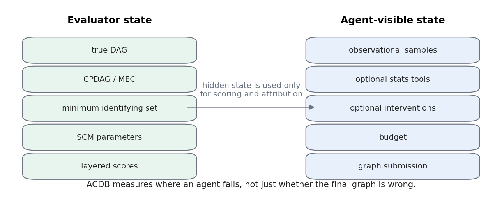
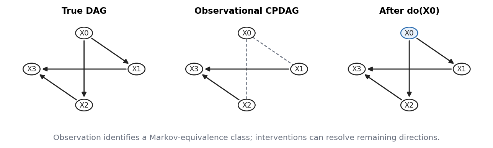
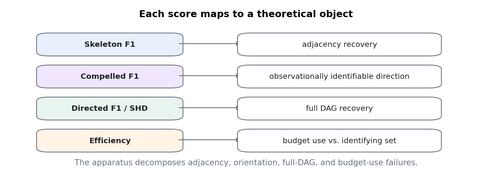
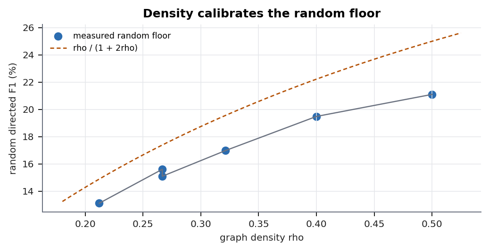
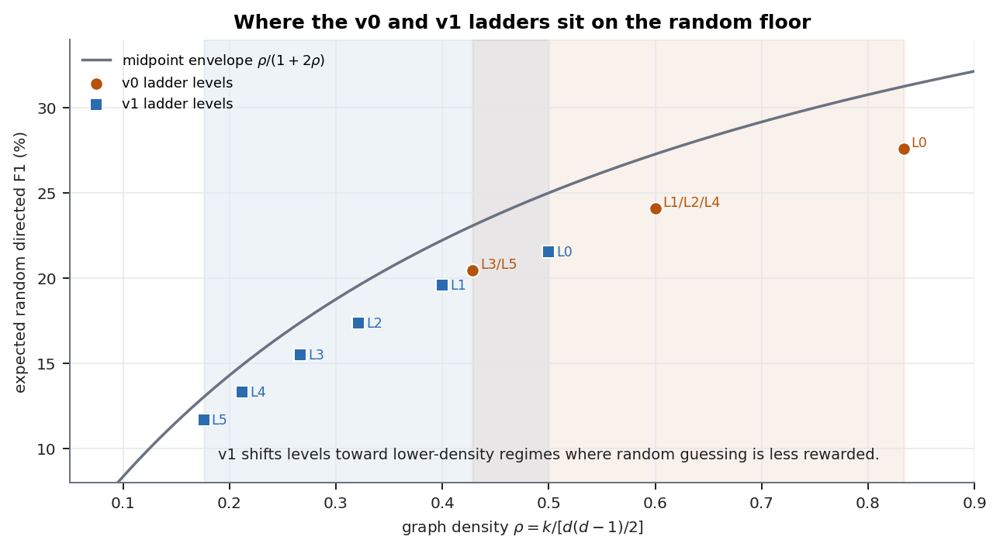
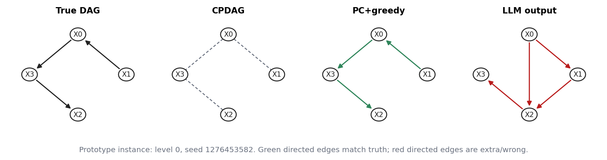
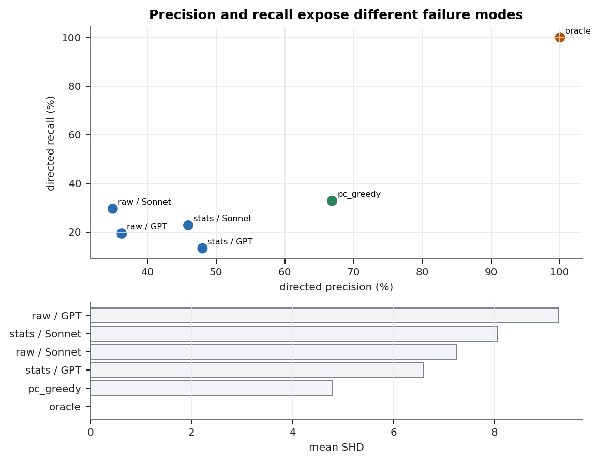
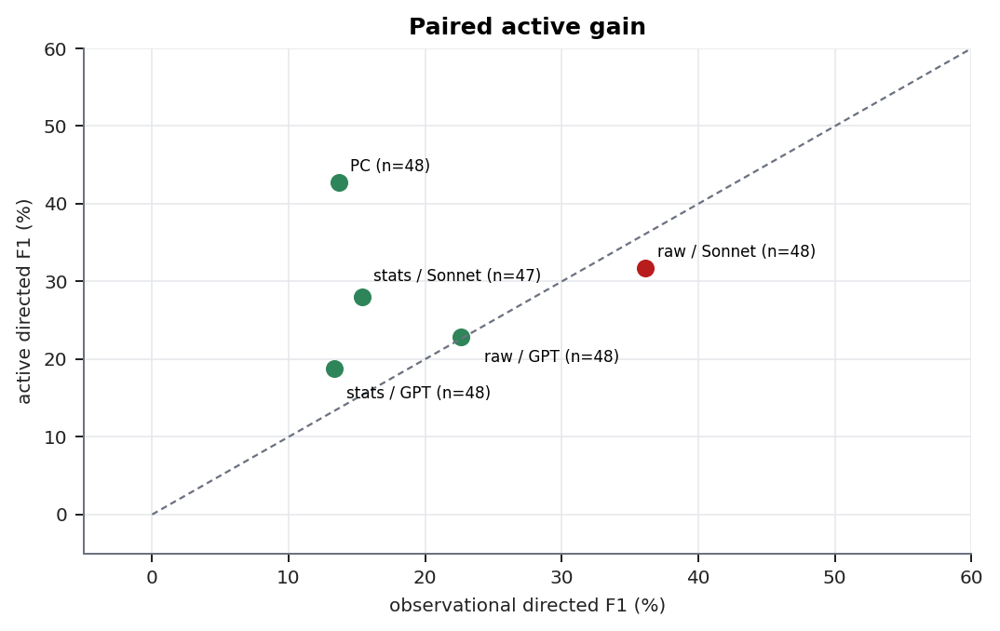

# ACDB: Active Causal Discovery Benchmark

ACDB is a scientific instrument for evaluating **agentic causal reasoning**. The benchmark does not only ask whether an agent recovers a causal graph. It fixes a hidden linear-Gaussian SCM, exposes limited evidence and actions to the agent, and scores separate layers of failure: adjacency recovery, observationally identifiable orientation, full DAG recovery, and intervention-budget use.

The key asymmetry is intentional: the evaluator can construct the true DAG, CPDAG/MEC, SCM metadata, and minimum identifying intervention set; the agent only sees observations, optional tools, optional interventions, and a budget.



## Current Status

- The active code path uses the **v1 scale-calibrated ladder**.
- The original v0 ladder is preserved in code as `ladder_levels_v0()`.
- Full GPT-5.4 and Claude Sonnet 4.6 results are **v0 results** and should be treated as calibration/audit evidence, not final v1 benchmark evidence.
- The only v1 LLM probe currently committed is a **partial DeepSeek V4 Flash smoke run** on OpenRouter.
- Final v1 results still need fresh random, PC/PC+greedy, and LLM runs on the locked v1 ladder and seed map.

## Benchmark Contract

ACDB instances are generated from fully observed, causally sufficient, linear-Gaussian SCMs with perfect single-node hard interventions. Graphs and SCMs are filtered for validity and faithfulness before sampling data.

Agent actions:

- `observe()` returns the observational panel once.
- `intervene(var, value)` returns interventional rows while budget remains.
- `submit_graph(directed_edges, undirected_edges)` terminates the episode.

All agents submit the same `GraphSubmission` object. This shared contract is used by LLM policies, PC baselines, random baselines, and oracle.



## Scoring Layers

Every metric has a theoretical referent:

- `skeleton_f1`: adjacency recovery.
- `compelled_f1`: observationally identifiable directions in the CPDAG.
- `directed_f1` and `dag_shd`: full DAG recovery.
- `efficiency`: intervention use relative to the minimum identifying intervention set.



Full scoring details: [`docs/specs/scoring.md`](docs/specs/scoring.md)

## Instance Generation

At a high level:

```text
sample DAG
compute CPDAG / MEC
reject invalid or poorly identified graphs
parameterize linear-Gaussian SCM
reject unfaithful SCMs
compute minimum identifying intervention set
permute labels
sample observational data
run agent episode
score submission
```

Full pseudocode: [`docs/specs/causal-discovery-v1-pseudocode.md`](docs/specs/causal-discovery-v1-pseudocode.md)

## V1 Ladder

The current ladder is a graph-scale/generalization ladder. After L0, sample sizes and noise are held fixed so graph scale is not confounded with decreasing statistical power.

| Level | d | k | density rho | n_obs | n_int | noise_var | slack | exact random Dir-F1 floor |
|---:|---:|---:|---:|---:|---:|---:|---:|---:|
| 0 | 4 | 3 | 0.500 | 50 | 25 | 0.5 | 2 | 0.215 |
| 1 | 6 | 6 | 0.400 | 50 | 25 | 1.0 | 2 | 0.196 |
| 2 | 8 | 9 | 0.321 | 50 | 25 | 1.0 | 2 | 0.173 |
| 3 | 10 | 12 | 0.267 | 50 | 25 | 1.0 | 2 | 0.155 |
| 4 | 12 | 14 | 0.212 | 50 | 25 | 1.0 | 2 | 0.133 |
| 5 | 14 | 16 | 0.176 | 50 | 25 | 1.0 | 2 | 0.117 |

Every v1 level now uses `budget_slack=2`, so the active agent gets two attempts beyond the
minimum identifying intervention set size.

Random floor note: for maximum possible directed edges `M=d(d-1)/2`, true edge count `k`, and random submitted edge count `m`, the conditional directed-F1 floor is

```text
E[F1 | m] = k*m / [M*(m+k)]
```

with the exact discrete floor

```text
E[F1] = (1/(M+1)) * sum_{m=0}^{M} k*m / [M*(m+k)]
```

This is why v1 reports a random floor beside directed F1 instead of treating random as a normal competitor.



The v1 ladder shifts levels away from the high-density v0 region and toward lower random-floor regimes:



## Supported Policies

Observational panel:

- `pc`: PC algorithm, observational only.
- `llm_raw_obs`: raw observational rows, no statistical tools, no interventions.
- `llm_stats_obs`: observational rows plus statistical tools.

Active panel:

- `pc_greedy`: PC CPDAG followed by budgeted greedy interventions.
- `llm_raw`: raw observational rows plus intervention actions.
- `llm_stats`: raw rows, statistical tools, and intervention actions.
- `oracle`: true DAG ceiling.

The LLM layer uses LiteLLM through `LiteLLMJSONPolicyModel`, with provider routing for OpenAI, Anthropic, and OpenRouter model strings.

## Figure Prototypes

The current figure prototypes are committed under:

[`reports/figure_prototypes/20260429T063348Z`](reports/figure_prototypes/20260429T063348Z)

They are narrative artifacts, not final paper figures. They intentionally mix conceptual diagrams, archived v0 aggregate plots, and the partial v1 DeepSeek graph-output trace where edge lists are available.

Representative graph-output visualization:



Aggregate v0 failure-mode visualization:



Paired active-gain visualization:



Interpretation caveat: active gain shows whether the active interface improves final directed-DAG recovery on paired instances. It does not by itself prove correct experimental reasoning; intervention choice and intervention interpretation require trace-level diagnostics.

## Archived V0 Results

These are the full v0 ladder runs. They are preserved because they motivated the v1 calibration work, especially the random-floor and density-leakage analysis.

Sources:

- GPT-5.4: [`traces/ladder/full_ladder_toolcall_run1/results_long.csv`](traces/ladder/full_ladder_toolcall_run1/results_long.csv)
- Claude Sonnet 4.6: [`traces/ladder/sonnet46_full_ladder_run1/results_long.csv`](traces/ladder/sonnet46_full_ladder_run1/results_long.csv)
- Random baseline: [`traces/ladder/random_uniform_baseline/results_random_dag_summary.csv`](traces/ladder/random_uniform_baseline/results_random_dag_summary.csv)

Rows are deduplicated by `(level, seed, panel, method, model)` and successful rows are averaged.

### GPT-5.4 V0 Overall

| Panel | Method | n | Skel F1 % | Dir P % | Dir R % | Dir F1 % | SHD | Eff % |
|---|---|---:|---:|---:|---:|---:|---:|---:|
| observational | `pc` | 48 | 62.1 | 82.6 | 10.0 | 13.6 | 6.250 | 100.0 |
| observational | `llm_raw_obs` | 48 | 65.7 | 74.1 | 19.2 | 22.6 | 9.396 | 100.0 |
| observational | `llm_stats_obs` | 48 | 35.9 | 68.4 | 9.2 | 13.3 | 6.750 | 100.0 |
| active | `pc_greedy` | 48 | 62.1 | 66.9 | 32.8 | 42.7 | 4.792 | 89.6 |
| active | `llm_raw` | 48 | 58.8 | 36.3 | 19.3 | 22.9 | 9.271 | 92.7 |
| active | `llm_stats` | 48 | 40.0 | 48.0 | 13.3 | 18.8 | 6.583 | 100.0 |
| active | `oracle` | 48 | 100.0 | 100.0 | 100.0 | 100.0 | 0.000 | 100.0 |

### Claude Sonnet 4.6 V0 Overall

| Panel | Method | n | Skel F1 % | Dir P % | Dir R % | Dir F1 % | SHD | Eff % |
|---|---|---:|---:|---:|---:|---:|---:|---:|
| observational | `pc` | 48 | 62.1 | 82.6 | 10.0 | 13.6 | 6.250 | 100.0 |
| observational | `llm_raw_obs` | 48 | 57.7 | 38.9 | 34.5 | 36.1 | 7.458 | 100.0 |
| observational | `llm_stats_obs` | 48 | 60.7 | 76.9 | 12.5 | 15.0 | 9.917 | 100.0 |
| active | `pc_greedy` | 48 | 62.1 | 66.9 | 32.8 | 42.7 | 4.792 | 89.6 |
| active | `llm_raw` | 48 | 56.3 | 35.0 | 29.6 | 31.7 | 7.250 | 97.9 |
| active | `llm_stats` | 47 | 62.7 | 46.0 | 22.7 | 28.0 | 8.064 | 100.0 |
| active | `oracle` | 48 | 100.0 | 100.0 | 100.0 | 100.0 | 0.000 | 100.0 |

V0 interpretation:

- PC+greedy provides the strongest non-oracle active reference.
- LLMs show different precision/recall profiles from PC; F1 alone hides this.
- Sonnet raw observational performance was strong in v0, but active access did not uniformly improve it.
- The v0 random floor was high enough to motivate v1 density calibration.

## V1 DeepSeek V4 Flash Probe

This is a **partial smoke/probe**, not a full v1 benchmark result.

Source:

[`traces/ladder/deepseek_v4_flash_ladder_2seed/results_long.csv`](traces/ladder/deepseek_v4_flash_ladder_2seed/results_long.csv)

Run status:

- Model: `openrouter/deepseek/deepseek-v4-flash`
- Deduplicated rows: `18`
- Successes: `16`
- Failures: `2`
- Both failures were OpenRouter/DeepInfra upstream `429` rate-limit errors.
- Coverage is limited to L0 plus one L1 PC/observational slice; do not compare this as a full ladder run.

| Panel | Method | n | Skel F1 % | Dir P % | Dir R % | Dir F1 % | SHD | Eff % |
|---|---|---:|---:|---:|---:|---:|---:|---:|
| observational | `pc` | 3 | 97.0 | 100.0 | 22.2 | 26.7 | 2.667 | 100.0 |
| observational | `llm_raw_obs` | 3 | 63.5 | 100.0 | 0.0 | 0.0 | 9.000 | 100.0 |
| observational | `llm_stats_obs` | 2 | 61.9 | 66.7 | 16.7 | 16.7 | 9.000 | 100.0 |
| active | `pc_greedy` | 3 | 97.0 | 100.0 | 94.4 | 97.0 | 0.333 | 66.7 |
| active | `llm_raw` | 2 | 61.9 | 25.0 | 50.0 | 33.3 | 4.000 | 50.0 |
| active | `llm_stats` | 1 | 66.7 | 66.7 | 66.7 | 66.7 | 2.000 | 100.0 |
| active | `oracle` | 2 | 100.0 | 100.0 | 100.0 | 100.0 | 0.000 | 100.0 |

The DeepSeek trace is useful mainly for validating the LiteLLM/OpenRouter path and full trace persistence. It is not enough evidence for model-level claims.

## Running Experiments

Install dependencies:

```powershell
uv sync
```

Run a small v1 smoke:

```powershell
uv run python run_ladder.py --levels 0 --seeds-per-level 1 --models openrouter/deepseek/deepseek-v4-flash --out-dir traces\ladder\deepseek_v4_flash_smoke
```

Run a fuller v1 ladder:

```powershell
uv run python run_ladder.py --levels 0,1,2,3,4,5 --seeds-per-level 8 --models gpt-5.4,claude-sonnet-4-6 --out-dir traces\ladder\v1_full_ladder
```

Resume or retry failures:

```powershell
uv run python run_ladder.py --levels 0,1,2,3,4,5 --seeds-per-level 8 --models gpt-5.4,claude-sonnet-4-6 --out-dir traces\ladder\v1_full_ladder --resume
uv run python run_ladder.py --levels 0,1,2,3,4,5 --seeds-per-level 8 --models gpt-5.4,claude-sonnet-4-6 --out-dir traces\ladder\v1_full_ladder --retry-failed
```

API keys are read from `.env` by default. OpenRouter models require `OPENROUTER_API_KEY`.

## Trace Guarantees

Current LLM traces include:

- `instance_metadata`: true DAG, CPDAG, optimal intervention set, ladder config, seed metadata.
- `llm_model_call`: request, raw provider response, parsed action, token usage, cost/latency/status.
- `llm_action`: parsed benchmark action.
- `llm_tool_result`: statistical tool outputs.
- `llm_intervention_result`: intervention rows and remaining budget.
- `work_success` / `work_failed`: terminal status and scores/errors.

This is designed so final scores can be audited against the exact tool calls and model outputs.

## Repository Map

```text
src/causal_discovery/
  agents/          LLM policies, LiteLLM adapter, action schemas, tools
  benchmark/       benchmark construction
  equivalence/     CPDAG / MEC theory helpers
  scoring/         GraphSubmission scoring
  scm/             linear-Gaussian SCM generation and diagnostics

run_ladder.py              main ladder runner
run_corr_obs_probe.py      correlation-summary LLM ablation probe
run_random_dag_baseline.py random DAG baseline
scripts/                   analysis and figure-generation helpers
docs/specs/                design and scoring specs
research/                  paper draft and paper figures
reports/figure_prototypes/ narrative figure prototypes
traces/                    experiment outputs
```

## Notes For Future V1 Work

- Re-run random baseline on the final v1 seed map.
- Re-run PC and PC+greedy on the same v1 seeds.
- Freeze prompts before running full LLM ladders.
- Report random-floor-adjusted interpretation beside directed F1.
- Treat raw, stats, and summary interfaces as evidence-interface ablations, not as a search for a single winning interface.
